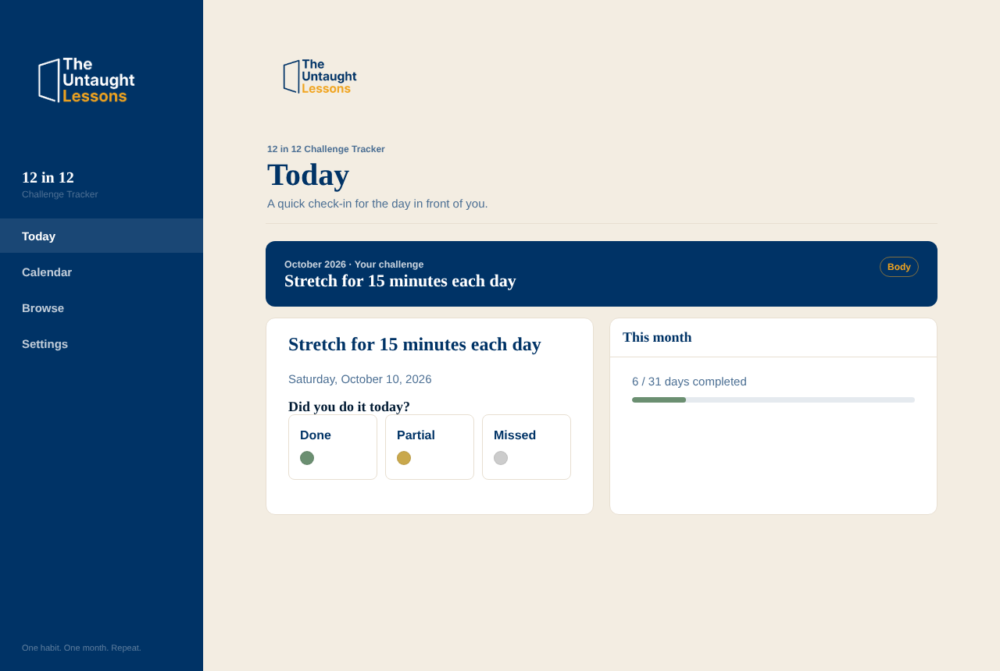
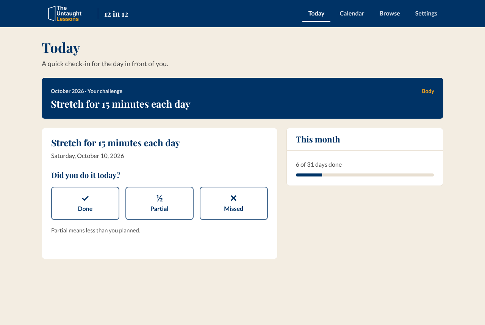
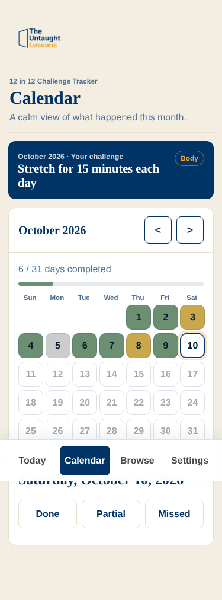
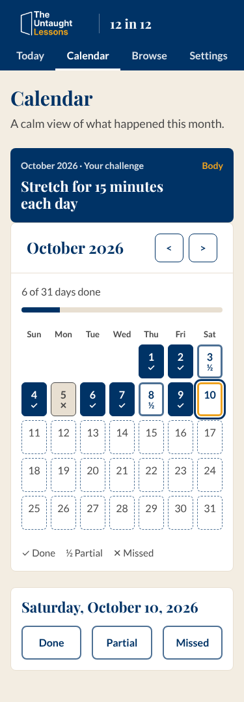

# 12 in 12: design document v1

> **The Faculty: UTL product leadership** 
> Professor (strategy) · Buzz (growth) · Sherlock (research) · Gizmo (design and engineering) · Bolt (security)
>
> **Accountable:** Professor · **Contributors:** Buzz, Sherlock, Gizmo · **Temporary specialists:** none · **Last updated:** 2026-10-10 · **Status:** Draft for founder review. **Nothing here is approved.** · **Source of truth:** this file. Inputs are the other notes in this folder. Assembled by the main session from the three Faculty inputs.

## Summary

**What it is:** 12 in 12 is a private habit tracker. You pick one small challenge for a month, log each day as Done, Partial or Missed, and see the month on a calendar. Twelve months make twelve small experiments. Data stays on the device. There is no account.

**What we found:** The original app was removed on 2026-07-30 because nothing linked to it. I recovered it from git history and kept it unchanged in `reference/12-in-12/OLD/20260717-original/`. The tools page describes a different product ("twelve short thinking drills in twelve minutes"). That text needs to change.

**Recommendation:** Relaunch it as a free, public, local-first tracker. Link outward to Executive Signature and the Think, Speak and Act program. Later, grow it into a TSA companion. Do not build accounts, rewards or email until the founder decides they are wanted.

## What was done in the staging area

- **Recovered:** The original four files, preserved in `OLD/`.
- **Restyled:** A working copy in `reference/12-in-12/` now matches the UTL look. This folder is excluded from the public site and from the cache-version script.
- **Verified:** A scripted click-through passes (onboarding, log a day, calendar, edit a day, export, no horizontal scroll at 375 px). Contrast ratios were calculated, and one failure was found and fixed.
- **Not verified:** Real phones, iOS Safari, offline behavior, screen reader use, and the service worker update flow.

To view it, run `python3 -m http.server 8061 --bind 127.0.0.1` in the repository root and open `http://127.0.0.1:8061/reference/12-in-12/`.

## Before and after

| Before | After |
|---|---|
|  |  |
|  |  |

## Design changes (against the v8 guide)

| Area | Original | Now |
|---|---|---|
| Type | Arial body, fallback serif headings | Lato body, Playfair Display headings, same as other UTL apps |
| Header | Side bar with its own layout | Navy app header with the logo linking home, like the other apps |
| Status | Colored dots only | Mark plus label: ✓ Done, ½ Partial, ✕ Missed. Color reinforces and never carries the meaning alone |
| Colors | A green and a gold outside the palette | Navy, steel, parchment and gold only |
| Badges | Pill badge for the category | Plain text label |
| Spacing | Heading touching the buttons, content hidden under a floating bottom bar on mobile | 16 px between controls, 24 px between groups, tabs live in the header so nothing covers content |
| Controls | 46 px buttons, light borders | 48 px targets, 16 px text, steel borders |
| Copy | Three contractions, two duplicate data notes | No contractions, one clear data note, "Partial means less than you planned" |
| Data | "Export" and "Import" | "Download backup" and "Restore from backup" |

**Measured contrast:** Text pairs range from 5.9:1 to 12.6:1. Control borders now use steel at 5.2:1. The first version used a light blue border at 1.46:1, which fails the 3:1 rule for identifying a control, so it was replaced.

**Documented exception:** Calendar cells sit 6 to 8 px apart. The guide asks for 16 px between separate controls, but seven columns at 375 px cannot fit that and still keep cells near 44 px. Founder to accept or overrule.

## How it fits the ecosystem

- **Funnel role (Buzz):** Free public front door for the Try step. Executive Signature already covers the same step with sharing built in, so 12 in 12 is a second door, not a replacement.
- **Connections:** Results pages could suggest a matching challenge through a template ID in the link. TSA exercises can become monthly challenges. Rewards, certificates and shared team challenges need sign in and a server, so they are later phases.
- **Sharing:** A month-complete card with the challenge title and days done. Notes and day detail are never included. Reuse the share pattern from Executive Signature.
- **Email:** Not possible yet. There is no address on a local-first app, and lifecycle email does not exist. A device reminder is the first option.
- **Money:** Keep the tracker free. The paid path is TSA membership. Payments are not live, so nothing is priced. Avoid ads, data sales and charging for export.

## What we may and may not say (Sherlock)

**Safe to say:** It is private and stored on your device. You log Done, Partial or Missed, add a note, and see a calendar. It has a library of starter challenges.

**Say with care:** "In one study, a missed day did not derail habit formation" and "habits took a median of 66 days, with a very wide range." Neither is a promise.

**Never say:** That habits form in 21 or 30 days, that streaks cause habits, that it changes behavior, or that it builds twelve habits. The honest framing is **a year of small experiments**. Competitor names and prices should not appear in public copy.

**Source quality warning:** Sherlock could reach only secondary summaries. No primary paper and no vendor page was read, and prices conflict. A primary-source check is needed before any public copy.

## Build plan (Gizmo)

| Option | What | Effort | Notes |
|---|---|---|---|
| **A (recommended)** | Local-first, public, in `apps/12-in-12/` | 4 to 6 days | No server, no flag, no gate. First service worker in the repository, scoped to its folder |
| B | A plus optional signed-in sync to Supabase | 10 to 14 days | New personal data, needs full Bolt review |
| C | Server-backed program activity with rewards and credentials | 18 to 25 days | Reward gaming risk, largest security surface |

**Ship steps for A:** move the files from staging to `apps/12-in-12/`, derive the service worker cache name from the repository's `?v=` value (the old fixed name breaks the cache rule), replace automatic updates with a "new version ready" prompt, add storage and date tests in the style of the existing tests, and change the tools page card last.

**Bolt review for A:** the import parser (untrusted JSON, size cap), the service worker scope, and the privacy wording. Options B and C need a full review.

## Risks

- **Name confusion:** The tools page describes a different product. Fix the copy or rename before launch.
- **Blind launch:** There is no public analytics. Without SITE-GRO-1 we cannot tell whether it works.
- **Data loss:** Clearing the browser removes the data. The backup button is the only protection.
- **Fit:** A habit tracker is not a thinking tool. It needs a clear bridge to Think clearly, Speak concisely, Act confidently, such as TSA-based starter challenges.

## Decisions (answered 2026-10-10)

| Decision | Answer |
|---|---|
| Public or members only | **Public and free** |
| Keep the name | **Yes, keep 12 in 12.** The tools card reads "12 in 12 daily challenges" |
| Rewards or credentials | **Not in version 1.** Rewards are for TSA only and already tracked there |
| Tools page card | **Done**, still marked Coming soon |
| Calendar spacing exception | **Accepted** |
| Build version 1 | **Yes, after the evidence check** |

The original list of questions follows for the record.

## Decisions needed from the founder (original list)

1. **Public or members only?** Recommended: public.
2. **Keep the name "12 in 12"?** Recommended: keep it, add "A year of small experiments".
3. **Should check-ins ever earn rewards or credentials?** This decides whether options B and C are worth building.
4. **Approve fixing the tools page card?** Suggested text: "12 in 12. A private tracker for one small experiment a month."
5. **Spend effort on a primary-source check** of the habit research and live competitor prices before any public copy?
6. **Accept the calendar spacing exception?**

## Next steps if approved

| Step | Owner | Effort |
|---|---|---|
| Founder answers the six decisions | Founder | 10 minutes |
| Primary-source evidence check | Sherlock | 0.5 day |
| Ship Option A to `apps/12-in-12/` with tests | Gizmo | 4 to 6 days |
| Bolt review of import parser, service worker, privacy wording | Bolt | 0.5 day |
| Fix tools page card and add launch plan | Buzz | 0.5 day |
